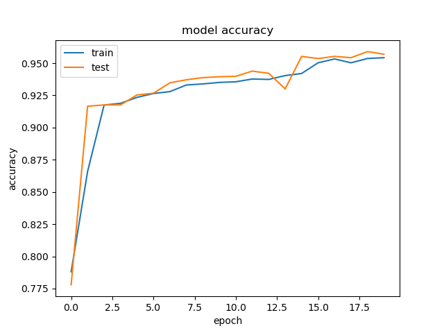
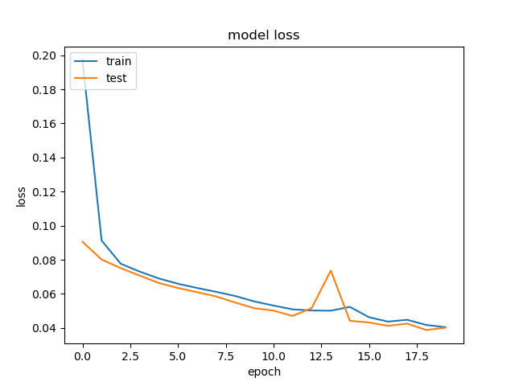

# Windows malware detection based on dynamic behaviors(Similarity API calls) using Multilayer Perceptron (MLP)
Our project is about to train an MLP prediction model to detect windows malwares based on counts of API calls similarity.

## Description 
We have collected about 12000 windows executable files from different public sources during web scraping and combining various datasets. Their 79% are malwares.  
Then, We implemented the [Cuckoo sandbox](https://cuckoosandbox.org/) locally to collect their dynamic behaviors report. After ordering, we selected the count of API calls as our feature vector to input the network.
Based on the above decision, we created our [CSV dataset](https://github.com/MohsenEbadpour/Windows-malware-detection-based-on-dynamic-behaviors-APIs-call-using-Multilayer-Perceptron-MLP/blob/main/dataset.csv) and [SQLite database](https://github.com/MohsenEbadpour/Windows-malware-detection-based-on-dynamic-behaviors-APIs-call-using-Multilayer-Perceptron-MLP/blob/main/Database-SQLite.db). The databsed has 3 table: 
1. "APIs" : List of APIs that has seen in the whole of our reports.(311 = feature vector)
2. "Reports" : List of reports with their _md5_ and [VirusTotal](https://www.virustotal.com/gui/) rank ("positive" column).
3. "APIs_Reports" : A many-to-many relationship between the above two tables plus a column("repetition") that indicates for the given report and given API how many calls occurred. 

The CSV dataset was created based on the above database. Column "OUTPUT" is our output(label) that it shows is given file is a malware or not. For files with equal or greater 10 rank in VirusTotal, we labeled 1, and for files with equal 0 rank in VirusTotal, we labeled 0. 

## Result of the trained model

Confusion matrix on unseen test data(20% of dataset):

## Contributor
- [Mohsen Ebadpour](https://github.com/MohsenEbadpour) 
Bachelor of science in computer engineering from [University of Mohaghegh Ardabili(UMA)](https://uma.ac.ir/index.php?slc_lang=en&sid=1) 
This project was part of my final project in BSc.

## Reports
For reports of executable files that Cuckoo sandbox generated(78~93GB), please contact to <mohsenebadpour@outlook.com>
